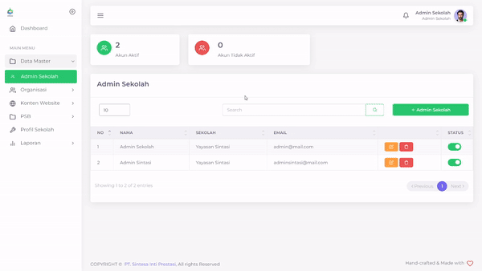

# Admin Sekolah

PPDB Sintasi memberikan kuasa terhadap admin sekolah untuk dapat membuat akun admin sekolah baru, mengubah Admin Sekolah yang ada, dan juga menghapus Admin Sekolah yang ada.

<figure><figcaption>
Tampilan Admin Sekolah PPDB Sintasi
</figcaption></figure>

## Membuat Akun Baru

<figure><figcaption>
Menambahkan akun Admin Sekolah yang baru
</figcaption></figure>

Anda dapat membuat akun Admin Sekolah baru apabila diperlukan.

Hal yang perlu dilakukan adalah:

1. Tekan tombol **+ Admin Sekolah**
2. Isi Nama lengkap, Email, dan Password
3. Tekan tombol Submit
4. Tunggu hingga muncul notifikasi "Success"

## Mengubah Akun Lama

<figure><figcaption></figcaption></figure>

Anda juga dapat mengubah akun Admin Sekolah anda yang lama.

Hal yang perlu dilakukan adalah:

1. Tekan tombol  pada baris akun Admin yang ingin diubah
2. Ubah bagan yang ingin anda ubah
3. Ketik ulang password anda maupun yang baru
4. Tekan tombol Submit
5. Tunggu hingga muncul notifikasi "Success"

## Menghapus Akun Admin Sekolah

<figure><figcaption></figcaption></figure>

Anda juga dapat menghapus akun Admin Sekolah anda apabila diperlukan

Hal yang perlu dilakukan adalah:

1. Tekan tombol  pada baris akun Admin yang ingin hapus
2. Tekan tombol "Ya, Hapus"
3. Tunggu hingga muncul notifikasi "Success"


Akun yang telah dihapus tidak akan balik kembali

