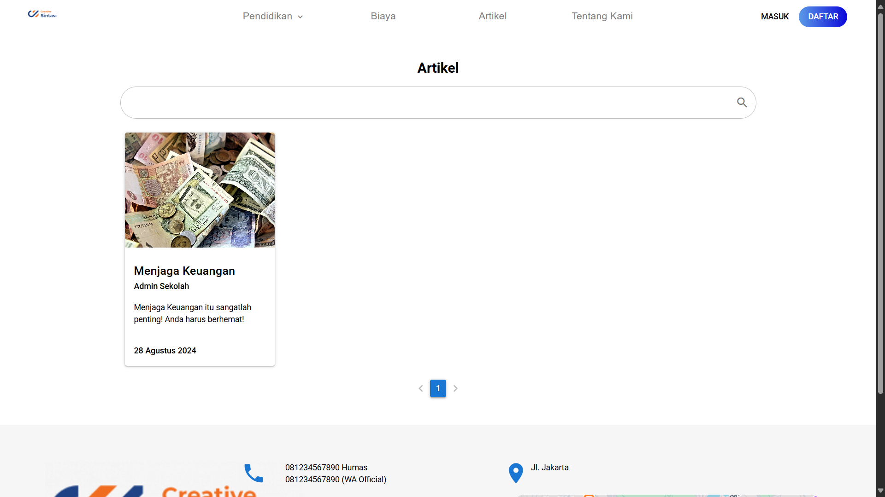
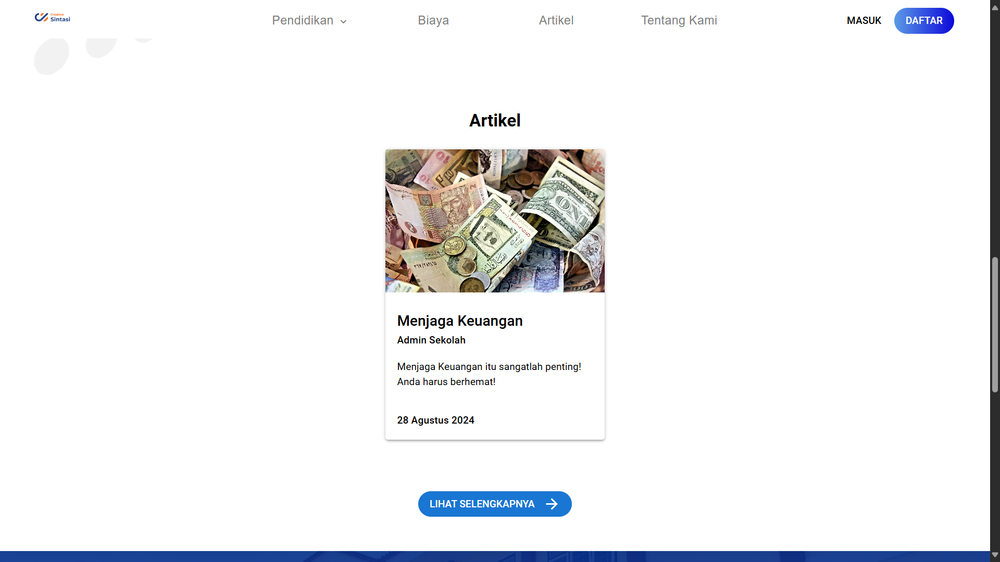
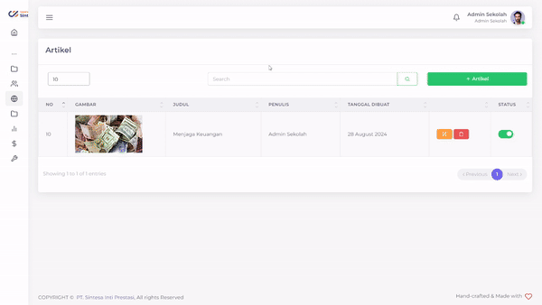
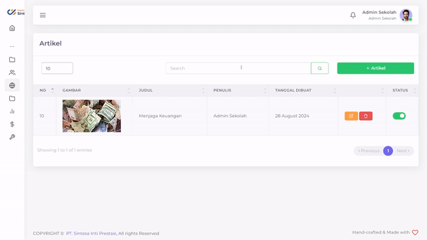

# Artikel Sekolah

<figure><figcaption>
Tampilan menu Artikel Sekolah PPDB Sintasi
</figcaption></figure>

PPDB Sintasi memberikan fitur untuk anda apabila anda mempunyai ide untuk menyuguhkan informasi terbaru mengenai sekolah dalam bentuk berita artikel. Setiap artikel mempunyai halaman sendiri sesuai dengan keperluan anda.

## Menambahkan Artikel Sekolah

<figure><figcaption>
Menambahkan Artikel Sekolah
</figcaption></figure>

Anda dapat menambahkan Artikel Sekolah anda semisalnya anda memiliki ide-ide menarik untuk memberikan kabar mengenai Sekolah anda

Tahap-tahap untuk menambahkan artikel adalah:

1. Tekan tombol '+ Artikel'
2. Tambahkan Gambar Artikel yang anda inginkan
3. Ketik Judul Artikel anda
4. Dengan _tools_ yang anda, anda bisa dengan leluasa membuat artikel yang anda inginkan
5. Tekan tombol Submit
6. Tunggu hingga data selesai diajukan

Setelah anda menambahkan Artikel, maka Artikel yang anda buat akan tertampil pada Halaman Utama dan Halaman Kumpulan Artikel

<figure><figcaption>
Halaman Tampilkan Artikel berisikan Artikel Sekolah
</figcaption></figure>

<figure><figcaption>
Halaman Utama menampilkan Artikel-artikel Sekolah
</figcaption></figure>

Selain itu, Artikel anda akan mendapatkan laman sendiri seperti berikut:

<figure><figcaption>
Halaman Isi dari Artikel
</figcaption></figure>

## Mengubah Artikel

<figure><figcaption>
Mengubah Artikel
</figcaption></figure>

Apabila anda merasa ada yang salah dengan artikel anda, anda dapat mengubahnya dengan langkah-langkah sebagai berikut:

1. Tekan tombol  pada baris Artikel yang ingin anda ubah
2. Pilih field yang ingin anda ubah
3. Ubahlah sesuai dengan yang anda inginkan
4. Tekan tombol Submit
5. Tunggu hingga data selesai diajukan

## Menghapus Artikel

<figure><figcaption>
Menghapus Artikel
</figcaption></figure>

Suatu saat, anda mungkin mempunyai pemikiran untuk menghapus Artikel yang sudah tidak relevan dengan sekolah anda.

Hal yang perlu dilakukan untuk menghapus Artikel adalah sebagai berikut:

1. Tekan tombol  pada baris Unit yang ingin anda hapus
2. Tekan tombol "Ya, Hapus"
3. Tunggu hingga muncul notifikasi "Success"


Anda juga dapat menonaktifkan Artikel sementara dengan menekan tombol pada kolom "Status"

