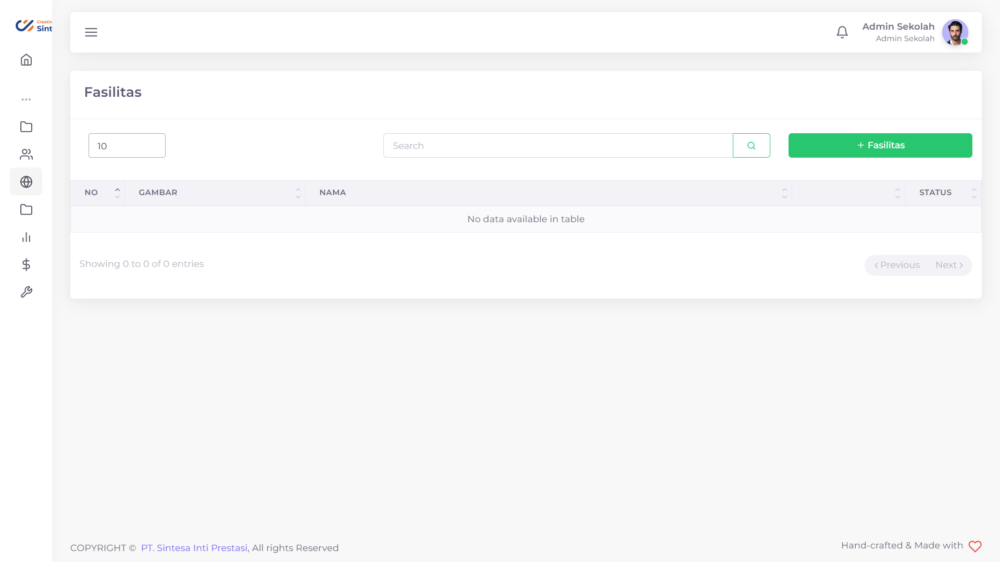
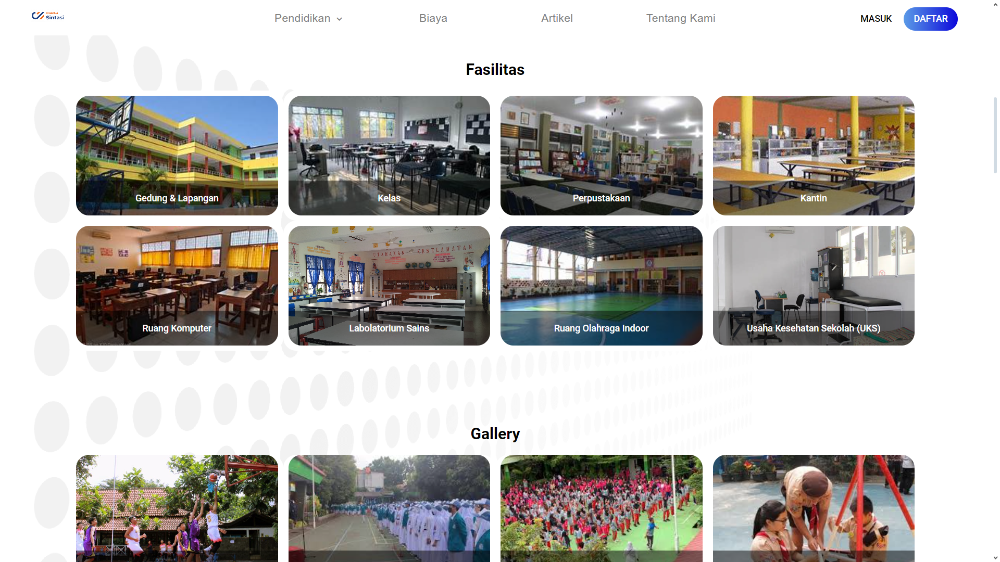

# Fasilitas Sekolah

Jika anda memiliki fasilitas-fasilitas sekolah yang unik dan ingin anda banggakan, anda bisa menambahkannya sesuai dengan yang anda mau.

<figure><figcaption>
Tampilan menu Fasilitas Sekolah PPDB Sintasi
</figcaption></figure>

<figure><figcaption>
Tampilan Fasilitas Sekolah pada Halaman Utama
</figcaption></figure>

## Menambahkan Fasilitas Sekolah

Anda bisa menambahkan Fasilitas Sekolah sebanyak yang anda inginkan dengan deskripsi dan gambar sesuai selera anda.

Hal yang perlu dilakukan untuk menambahkan Fasilitas Sekolah adalah:

1. Tekan tombol "+ Fasilitas Sekolah"
2. Isi Nama Konten dengan deskripsi yang anda inginkan
3. Tambahkan gambar yang anda inginkan
4. Tekan tombol "Submit"
5. Tunggu hingga muncul notifikasi "Success"


Gambar memiliki dimensi maksimal 400x220 pada Halaman Utama


## Mengubah Fasilitas Sekolah

Jika ada beberapa detail yang ingin anda ubah dari Fasilitas Sekolah anda, anda bisa mengubahnya.

Hal yang perlu anda lakukan adalah sebagai berikut:

1. Tekan tombol  pada baris Fasilitas Sekolah yang ingin anda ubah
2. Pilih field yang ingin anda ubah
3. Ubahlah sesuai dengan yang anda inginkan
4. Tekan tombol Submit
5. Tunggu hingga data selesai diajukan

## Menghapus Fasilitas Sekolah

Apabila anda mempunyai pemikiran jika salah satu Fasilitas Sekolah sudah tak relevan, anda bisa menghapusnya.

Hal yang perlu anda lakukan adalah sebagai berikut:

1. Tekan tombol  pada baris Fasilitas Sekolah yang ingin anda hapus
2. Tekan tombol "Ya, Hapus"
3. Tunggu hingga muncul notifikasi "Success"


DIrekomendasikan anda memiliki minimal satu Fasilitas Sekolah pada Halaman Utama anda

