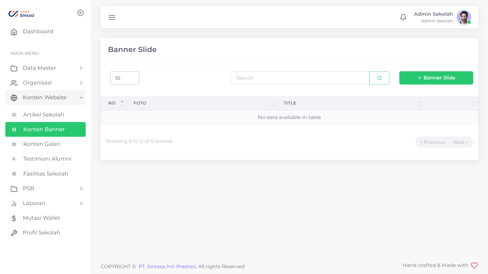
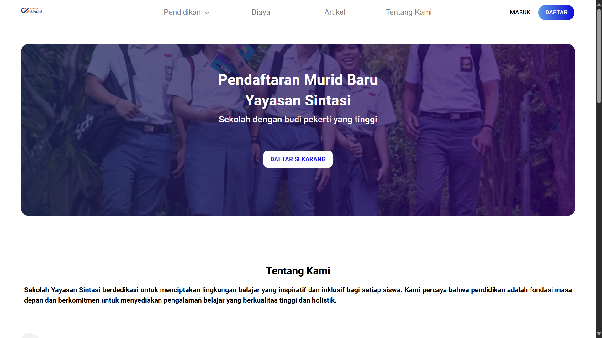

# Konten Banner

Ketika Pengguna mengunjungi website anda, dibutuhkan pengait yang kuat untuk dapat menarik perhatian para pengunjung. Oleh karena itu, kami memberikan fitur Konten Banner yang dapat anda isi dengan gambar beserta deskripsi singkat dari sekolah anda

<figure><figcaption>
Tampilan menu Konten Banner PPDB Sintasi
</figcaption></figure>

<figure><figcaption>
Tampilan Banner pada Halaman Utama
</figcaption></figure>

## Menambahkan Konten Banner

<figure><figcaption></figcaption></figure>

Anda bisa menambahkan Konten Banner sebanyak yang anda inginkan dengan deskripsi dan gambar sesuai selera anda.

Hal yang perlu dilakukan untuk menambahkan Konten Banner adalah:

1. Tekan tombol "+ Banner"
2. Isi Nama Konten dengan deskripsi yang anda inginkan
3. Tambahkan gambar yang anda inginkan
4. Tekan tombol "Submit"
5. Tunggu hingga muncul notifikasi "Success"


Gambar memiliki dimensi maksimal 1400x400 dengan format .JPG atau .JPEG pada Halaman Utama


## Mengubah Konten Banner

<figure><figcaption></figcaption></figure>

Jika ada beberapa detail yang ingin anda ubah dari Konten Banner anda, anda bisa mengubahnya.

Hal yang perlu anda lakukan adalah sebagai berikut:

1. Tekan tombol  pada baris Artikel yang ingin anda ubah
2. Pilih field yang ingin anda ubah
3. Ubahlah sesuai dengan yang anda inginkan
4. Tekan tombol Submit
5. Tunggu hingga data selesai diajukan

## Menghapus Konten Banner

<figure><figcaption></figcaption></figure>

Apabila anda mempunyai pemikiran jika salah satu Konten Banner sudah tak relevan, anda bisa menghapusnya.

Hal yang perlu anda lakukan adalah sebagai berikut:

1. Tekan tombol  pada baris Unit yang ingin anda hapus
2. Tekan tombol "Ya, Hapus"
3. Tunggu hingga muncul notifikasi "Success"


DIrekomendasikan anda memiliki minimal satu Konten Banner pada Halaman Utama anda


