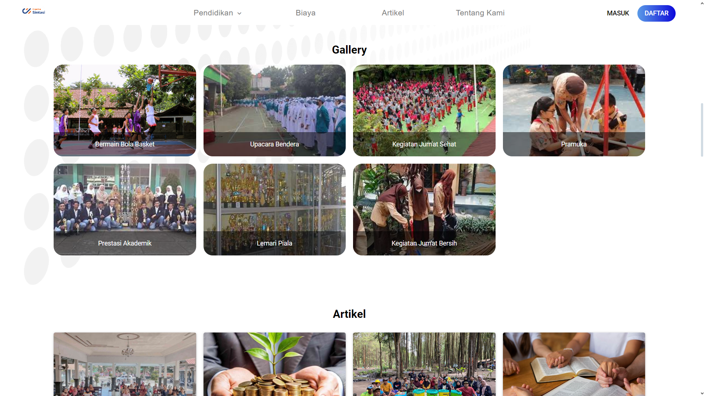
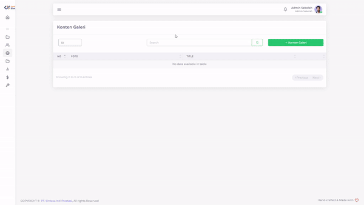
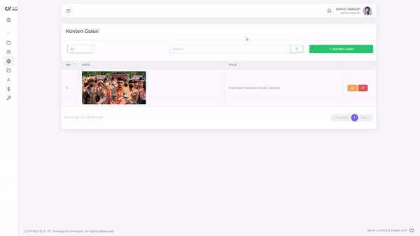

# Konten Galeri

Suatu Website tentunya terlihat kosong apabila tidak ada hidangan visual yang menarik. Oleh karena itu, kami menyediakan fitur dimana anda bisa dengan leluasa menunjukkan isi dari sekolah anda dengan fitur Galeri. Gambar yang bisa anda berikan tak terbatas, dan bisa dikustomisasi sesuai yang anda inginkan.

<figure><figcaption>
Tampilan menu Konten Galeri PPDB Sintasi
</figcaption></figure>

<figure><figcaption>
Tampilan Galeri pada Halaman Utama
</figcaption></figure>

## Menambahkan Konten Galeri

<figure><figcaption></figcaption></figure>

Anda bisa menambahkan Konten Banner sebanyak yang anda inginkan dengan deskripsi dan gambar sesuai selera anda.

Hal yang perlu dilakukan untuk menambahkan Konten Gallery adalah:

1. Tekan tombol "+ Konten Galeri"
2. Isi Nama Konten dengan deskripsi yang anda inginkan
3. Tambahkan gambar yang anda inginkan
4. Tekan tombol "Submit"
5. Tunggu hingga muncul notifikasi "Success"


Gambar memiliki dimensi maksimal 400x220 pada Halaman Utama


## Mengubah Konten Galeri

<figure><figcaption></figcaption></figure>

Jika ada beberapa detail yang ingin anda ubah dari Konten Galeri anda, anda bisa mengubahnya.

Hal yang perlu anda lakukan adalah sebagai berikut:

1. Tekan tombol  pada baris Konten Galeri yang ingin anda ubah
2. Pilih field yang ingin anda ubah
3. Ubahlah sesuai dengan yang anda inginkan
4. Tekan tombol Submit
5. Tunggu hingga data selesai diajukan

## Menghapus Konten Galeri

<figure><figcaption></figcaption></figure>

Apabila anda mempunyai pemikiran jika salah satu Konten Galeri udah tak relevan, anda bisa menghapusnya.

Hal yang perlu anda lakukan adalah sebagai berikut:

1. Tekan tombol  pada baris Konten Galeri yang ingin anda hapus
2. Tekan tombol "Ya, Hapus"
3. Tunggu hingga muncul notifikasi "Success"


Direkomendasikan anda memiliki minimal satu Konten Galeri pada Halaman Utama anda

