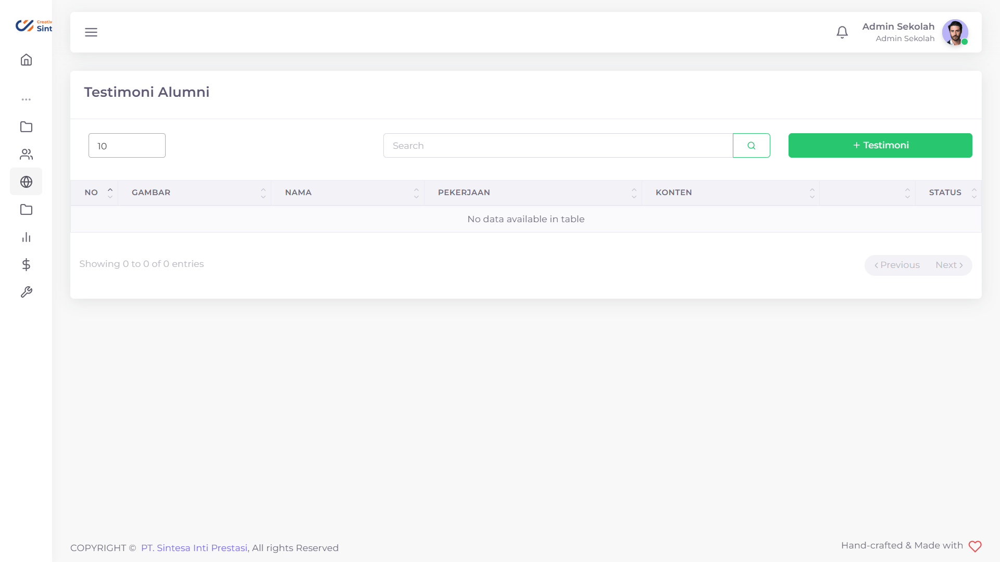
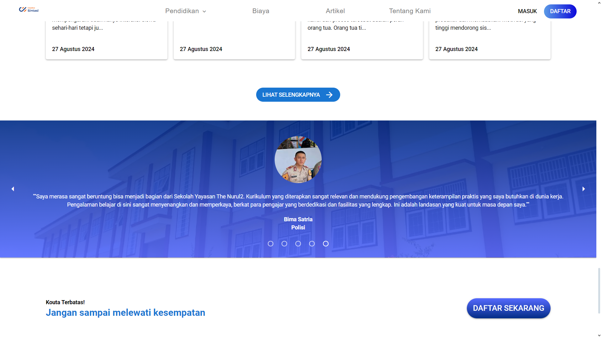
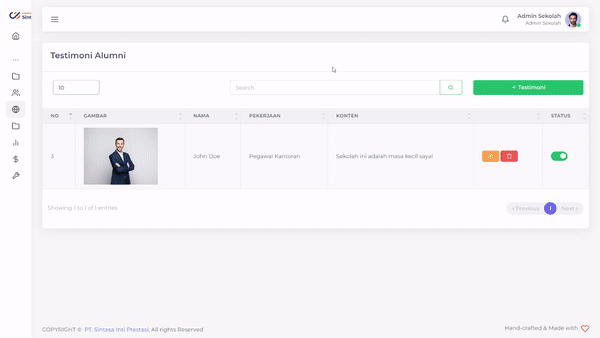
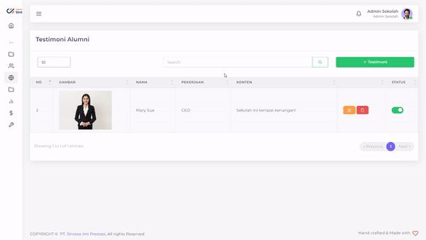

# Testimoni Alumni

Untuk dapat memikat hati calon Murid anda, anda mungkin mempunyai pemikiran untuk meminta mantan Murid anda yang pernah bersekolah di sekolah anda untuk memberikan pengalamannya kepada calon Murid baru. Oleh karena itu, kamu membantu mengakomodasi bagan untuk memperlihatkan testimoni-testimoni Alumni Sekolah

<figure><figcaption></figcaption></figure>

<figure><figcaption></figcaption></figure>

## Menambahkan Testimoni Alumni

<figure><figcaption></figcaption></figure>

Anda bisa menambahkan Testimoni sebanyak yang anda inginkan.

Hal yang perlu dilakukan untuk menambahkan Konten Banner adalah:

1. Tekan tombol "+ Banner"
2. Isi Nama Testimoni yang akan ditambahkan
3. Tambahkan Pekerjaan Testimoni
4. Isi Konten sesuai dengan pesan dari testimoni
5. Tekan tombol "Submit"
6. Tunggu hingga muncul notifikasi "Success"

## Mengubah Testimoni Alumni

<figure><figcaption></figcaption></figure>

Jika ada beberapa detail yang ingin anda ubah dari Testimoni Alumni anda, anda bisa mengubahnya.

Hal yang perlu anda lakukan adalah sebagai berikut:

1. Tekan tombol  pada baris Testimoni Alumni yang ingin anda ubah
2. Pilih field yang ingin anda ubah
3. Ubahlah sesuai dengan yang anda inginkan
4. Tekan tombol Submit
5. Tunggu hingga data selesai diajukan

## Menghapus Testimoni Alumni

<figure><figcaption></figcaption></figure>

Apabila anda mempunyai pemikiran jika salah satu Testimoni Alumni sudah tak relevan, anda bisa menghapusnya.

Hal yang perlu anda lakukan adalah sebagai berikut:

1. Tekan tombol  pada baris Testimoni Alumni yang ingin anda hapus
2. Tekan tombol "Ya, Hapus"
3. Tunggu hingga muncul notifikasi "Success"


Disarankan anda memiliki minimal satu Testimoni Alumni pada Halaman Utama anda

