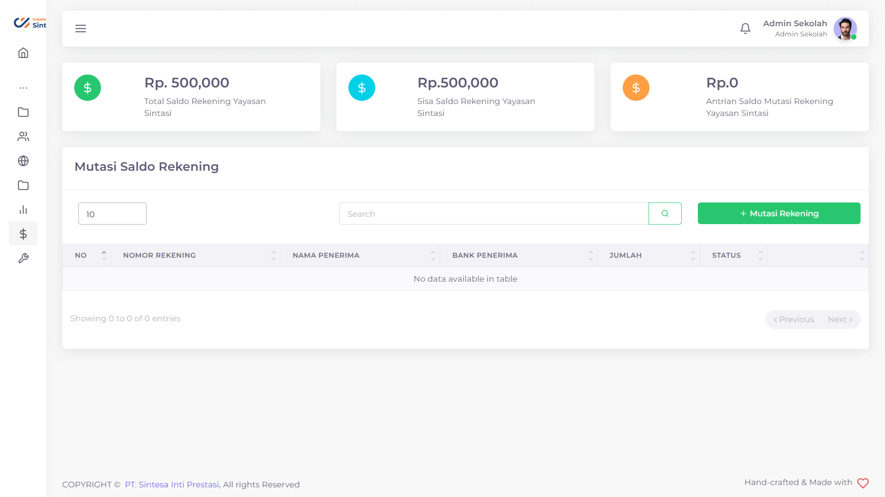

# Mutasi Rekening

Pada saat pendaftaran siswa baru, Calon Murid Baru akan diwajibkan membayar biaya-biaya yang terkait seperti biaya formulir, biaya pangkal, dan sebagainya. Untuk memudahkan proses transaksi, PPDB Sintasi menggunakan perantara Rekening Bersama dan dapat dimutasikan kapanpun, dan dimanapun

<figure><figcaption>
Tampilan Mutasi Rekening PPDB Sintasi
</figcaption></figure>

## Membuat Mutasi Rekening

Anda dapat melakukan mutasi rekening dari Rekening Bersama menuju rekening anda <mark style="color:yellow;">**selama saldo tidak melebihi saldo anda yang tersedia**</mark>

Hal yang perlu dilakukan adalah:

1. Tekan tombol **+ Mutasi Rekening**
2. Isi Jumlah Dana yang diinginkan
3. Tekan tombol Submit
4. Tunggu hingga muncul notifikasi "Success"

Diperlukan waktu maksimal 2x24 jam untuk pihak Sintasi memverifikasi mutasi rekening dan anda akan diberikan notifikasi apabila mutasi rekening anda diterima


Data Rekening yang akan menjadi tujuan sesuai yang tertera pada [Profil Sekolah](../panduan-awal/mengatur-profil-sekolah.md). Pastikan data anda telah sesuai. Jika ada perubahan mohon ubah pada bagan [Profil Sekolah](../panduan-awal/mengatur-profil-sekolah.md)


## Mengubah Mutasi Rekening

Anda dapat mengubah permintaan mutasi rekening anda selama mutasi rekening anda belum diterima oleh pihak sintasi. Perubahan yang bisa ubah hanyalah jumlah saldo dana yang anda inginkan

Hal yang perlu anda lakukan adalah:

1. Tekan tombol  pada baris Mutasi Rekening yang ingin anda ubah
2. Ubahlah jumlah dana yang anda ingin tarik sesuai dengan yang anda inginkan
3. Tekan tombol Submit
4. Tunggu hingga data selesai diajukan


Perubahan permintaan mutasi rekening akan memindahkan antrian permintaan Anda ke posisi paling belakang.


## Membatalkan Mutasi Rekening

Jika anda mengubah pemikiran anda dan ingin membatalkan Mutasi Rekening, maka anda dapat membatalkannya dengan langkah sebagai berikut:

1. Tekan tombol  pada baris Mutasi Rekening yang ingin anda hapus
2. Tekan tombol "Ya, Batal
3. Tunggu hingga muncul notifikasi "Success"

## Status Mutasi Rekening

Jika anda masih memiliki Mutasi Rekening yang berada pada antrian, maka akan ada tiga status yang mungkin saja bisa diberikan kepada permintaan Mutasi Rekening anda

### &#x20;Menunggu&#x20;

<figure><figcaption>
Permintaan menunggu
</figcaption></figure>

Jika Status antrian anda masih "Menunggu", pihak Sintasi kami sedang memvalidasi permintaan anda dan akan diinformasikan paling lambat 2x24 jam. Ketika status Antrian anda masih Menunggu, maka anda masih mempunyai kesempatan untuk mengubah dan menghapus permintaan Mutasi Rekening anda.

### Diterima

<figure><figcaption>
Permintaan diterima
</figcaption></figure>

Jika Status antrian anda adalah "Diterima", pihak Sintasi telah memvalidasi permintaan anda dan mengirimkan saldo sesuai dengan jumlah dana yang anda minta kepada nomor rekening yang tertera

### Ditolak

<figure><figcaption>
Permintaan ditolak
</figcaption></figure>

Jika Status antrian anda adalah "Ditolak", pihak Sintasi menemukan sesuatu yang tidak sesuai dengan permintaan anda dan memberikan alasan penolakan mutasi rekening anda.

Anda bisa menekan status "Ditolak" anda untuk melihat alasan penolakan Mutasi Rekening anda.

<figure><figcaption>
Contoh alasan penolakan permintaan Mutasi Rekening anda
</figcaption></figure>
