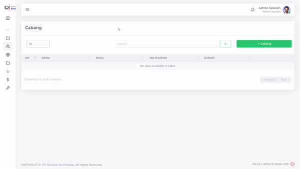
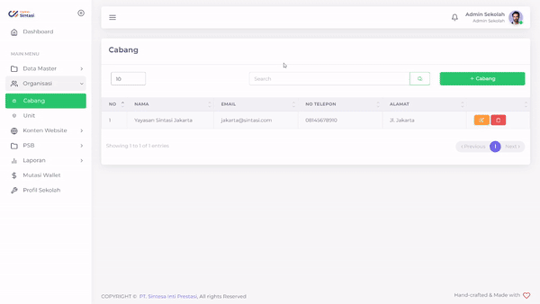
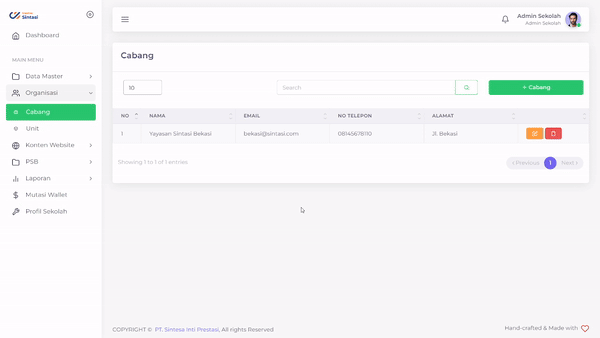

# Cabang

Sekolah anda mungkin memiliki cabang pada domisili lain yang bukan berada pada alamat pusat. Oleh karena itu, kami memberikan tata cara bagaimana untuk menambahkan cabang-cabang sekolah anda.

<figure><figcaption>
Tampilan menu Cabang PPDB Sintasi
</figcaption></figure>

## Menambahkan Cabang Sekolah

<figure><figcaption>
Menambahkan cabang sekolah anda
</figcaption></figure>

Anda dapat menambahkan Cabang Sekolah sesuai dengan yang anda inginkan.

Hal yang perlu dilakukan adalah:

1. Tekan tombol '+ Cabang'
2. Ketik Nama Cabang Sekolah anda
3. Ketik Email khusus Cabang Sekolah anda
4. Ketik Nomor Telepon khusus Cabang Sekolah anda
5. Ketik Alamat khusus Cabang Sekolah anda
6. Tekan tombol Submit
7. Tunggu hingga data selesai diajukan

## Mengubah Cabang Sekolah Anda

<figure><figcaption>
Mengubah Cabang Sekolah Anda
</figcaption></figure>

Apabila ada perubahan atas Cabang Sekolah anda, anda dapat dengan mudah mengubahnya.

Hal yang perlu dilakukan adalah:

1. Tekan tombol 
2. Tekan field yang ingin anda ubah
3. Ubahlah sesuai dengan yang anda inginkan
4. Tekan tombol Submit
5. Tunggu hingga data selesai diajukan

### Menghapus Cabang Sekolah Anda

<figure><figcaption>
Menghapus Cabang Sekolah Anda
</figcaption></figure>

Semisalnya terjadi kesalahan terhadap Cabang Sekolah anda, anda dapat menghapusnya dari sistem.

Hal yang perlu dilakukan adalah

1. Tekan tombol 
2. Tekan tombol "Ya, Hapus"
3. Tunggu hingga muncul notifikasi "Success"


Apabila anda menghapus suatu cabang, maka semua unit di dalam cabang itu juga akan terhapus!

