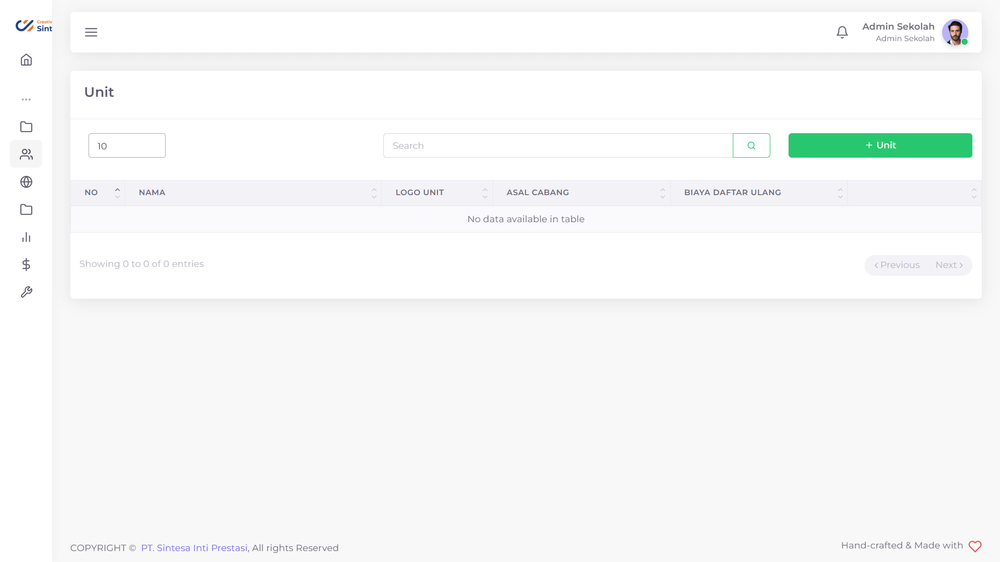
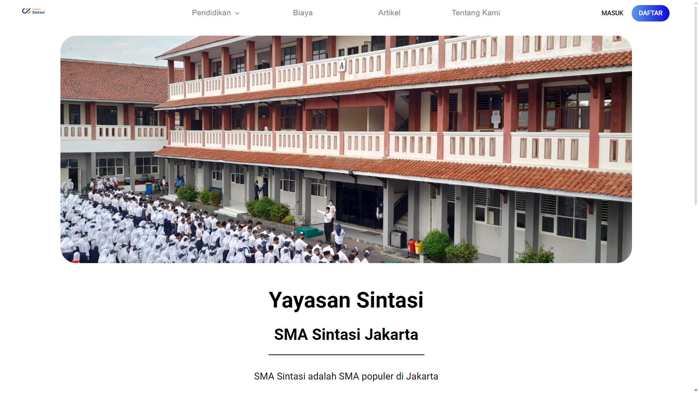
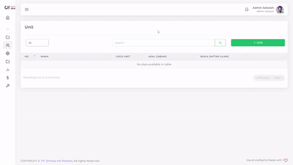
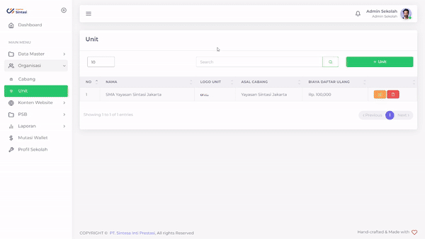
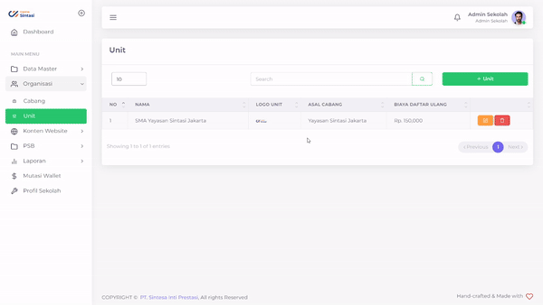

# Unit

Pada suatu cabang sekolah, sekolah anda mungkin saja menyediakan berbagai jenjang pendidikan dimulai dari pra-sekolah hingga Sekolah Menengah Atas. PPDB Sintasi menyediakan fitur Unit untuk memberikan pengguna kuasa untuk menambahkan unit sesuai dengan sekolah masing-masing. Setiap Unit Sekolah juga disediakan halaman yang memberikan informasi mengenai masing-masing Unit Sekolah

<figure><figcaption>
Tampilan Menu Unit PPDB Sintasi
</figcaption></figure>

<figure><figcaption>
Tampilan Website Unit Sekolah Sintasi
</figcaption></figure>

## Menambahkan Unit Sekolah

<figure><figcaption></figcaption></figure>

Unit Sekolah mendapatkan halaman khusus yang akan menjelaskan isi-isi khusus untuk Unit Sekolah tersebut. Unit Sekolah akan terafiliasi dengan[ Cabang](cabang.md) dimana Unit tersebut berada.

Hal yang perlu dilakukan adalah:

1. Tekan tombol '+Unit'
2. Pilih Logo khusus Unit Sekolah anda
3. Pilih Foto Unit Sekolah anda
4. Ketik nama Unit Sekolah anda
5. Ketik Biaya Daftar Ulang khusus Unit Sekolah anda
6. Ketik Konten Halaman Unit untuk halaman Unit Sekolah anda
7. Pilih Cabang Sekolah tempat Unit Sekolah anda berada
8. Tekan Tombol Submit
9. Tunggu hingga notifikasi Success

## Mengubah Unit Sekolah

<figure><figcaption></figcaption></figure>

Apabila saat suatu waktu Unit Sekolah anda memiliki perubahan, maka anda bisa dengan mudah mengubahnya.

Hal yang perlu dilakukan adalah:

* Tekan tombol  pada baris Unit yang ingin anda ubah
* Pilih field yang ingin anda ubah
* Ubahlah sesuai dengan yang anda inginkan
* Tekan tombol Submit
* Tunggu hingga data selesai diajukan

## Menghapus Unit Sekolah

<figure><figcaption></figcaption></figure>

Semisalnya terjadi kesalahan terhadap Unit Sekolah anda, anda dapat menghapusnya dari sistem.

Hal yang perlu dilakukan adalah

1. Tekan tombol  pada baris Unit yang ingin anda hapus
2. Tekan tombol "Ya, Hapus"
3. Tunggu hingga muncul notifikasi "Success"
