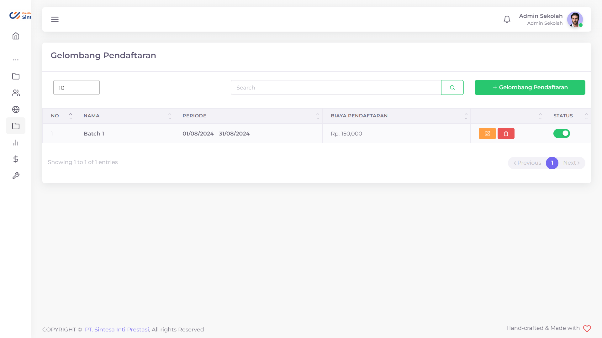
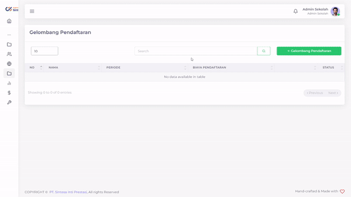

# Gelombang Pendaftaran

Ketika Calon Murid Baru ingin mendaftarkan dirinya, mereka hanya bisa mendaftar pada periode tertentu. Anda bisa mengatur tanggal dan biaya pendaftaran periode-periode tersebut dengan mudah

<figure><figcaption>
Tampilan menu Gelombang Pendaftaran PPDB Sintasi
</figcaption></figure>

## Menambahkan Gelombang Pendaftaran

<figure><figcaption></figcaption></figure>

Anda bisa menambahkan Gelombang sebanyak yang anda inginkan pada periode tertentu.

Hal yang perlu dilakukan untuk menambahkan Gelombang Pendaftaran adalah:

1. Tekan tombol "+ Gelombang Pendaftaran"
2. Isi Nama Gelombang Pendaftaran dengan nama yang anda inginkan
3. Pilih Periode Awal dan Akhir Periode Pendaftaran (MM/DD/YYYY)
4. Ketik Biaya Pendaftaran pada periode yang anda inginkan
5. Pilih Unit Sekolah yang membuka Gelombang Pendaftaran
6. Tekan tombol "Submit"
7. Tunggu hingga muncul notifikasi "Success"

## Mengubah Gelombang Pendaftaran

Apabila anda merasa ada yang salah dengan Gelombang Pendaftaran anda, anda dapat mengubahnya dengan langkah-langkah sebagai berikut:

1. Tekan tombol  pada baris Gelombang yang ingin anda ubah
2. Pilih field yang ingin anda ubah
3. Ubahlah sesuai dengan yang anda inginkan
4. Tekan tombol Submit
5. Tunggu hingga data selesai diajukan

## Menghapus Gelombang Pendaftaran

Suatu saat, anda mungkin mempunyai pemikiran untuk menutup Gelombang Pendaftaran lebih cepat dari yang anda kira.

Hal yang perlu dilakukan untuk menghapus Gelombang Pendaftaran adalah sebagai berikut:

1. Tekan tombol  pada baris Gelombang yang ingin anda hapus
2. Tekan tombol "Ya, Hapus"
3. Tunggu hingga muncul notifikasi "Success"


Anda juga dapat menonaktifkan Gelombang sementara dengan menekan tombol pada kolom "Status"


