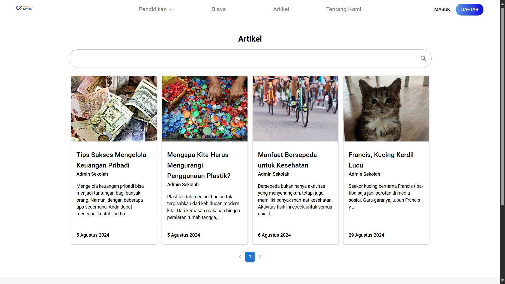

# Halaman Kumpulan Artikel

<figure><figcaption>
Halaman Kumpulan Artikel
</figcaption></figure>

Apabila anda telah membuat berbagai [Artikel](../../fitur-website-ppdb-sintasi/konten-website/artikel-sekolah.md) pada Website PPDB Sintasi, maka artikel-artikel anda akan tertera pada bagian "Artikel" yang terdapat pada _Navigation Bar_ website anda.

Komponen yang terdiri dari Halaman ini adalah Fitur Searching dan juga _pagination_ Artikel dengan jumlah maksimal 8 dan minimal satu per halaman
