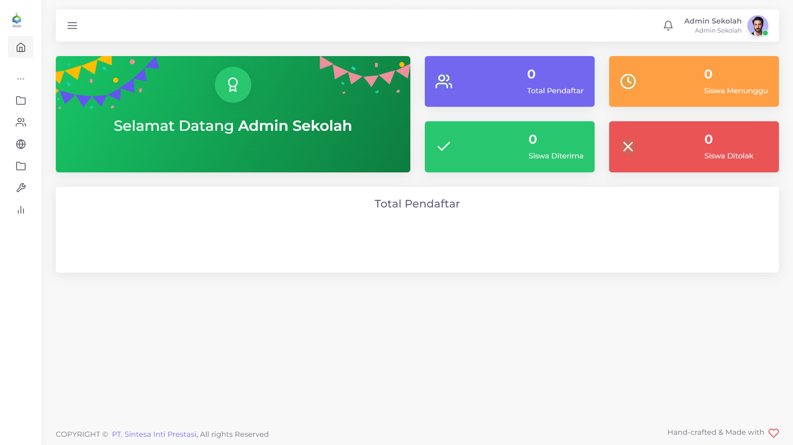
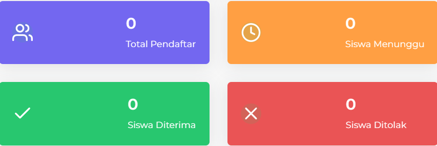

# Dashboard

<figure><figcaption>
Dashboard PPDB Sintasi
</figcaption></figure>

Terdapat beberapa informasi yang ditampilkan pada Dashboard PPDB Sintasi. Antara lain:

* **Nama Pengguna**

<figure><figcaption></figcaption></figure>

* **Data Total Pendaftar Sekolah**

<figure><figcaption></figcaption></figure>


Informasi yang ditampilkan dapat berubah seiring waktu dan akan diperbaharui secara berkala

