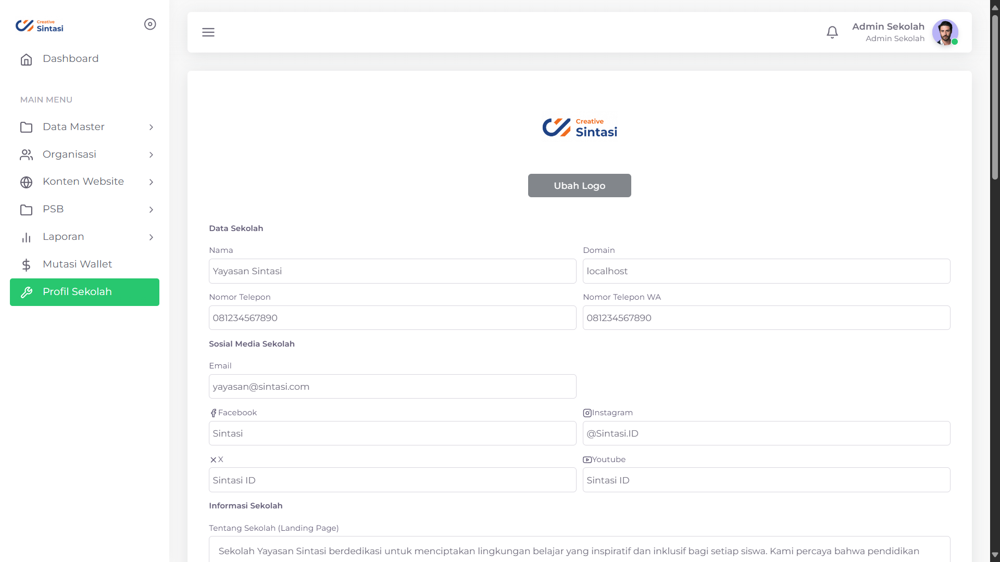
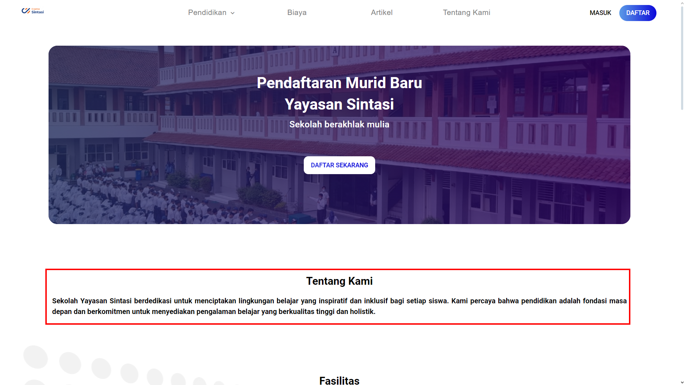
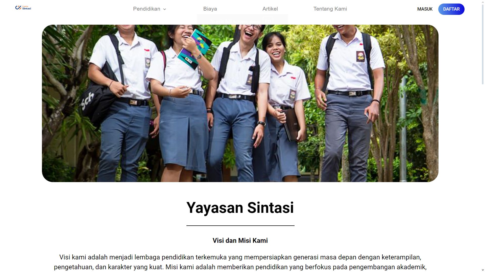
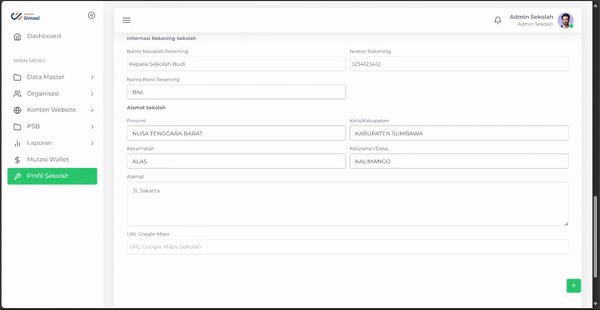

# Mengatur Profil Sekolah

<figure><figcaption>
Formulir Profil Sekolah PPDB Sintasi
</figcaption></figure>

## Overview

Saat anda ingin membuat website Sekolah, tentunya diperlukan data-data penting sekolah anda untuk ditampilkan kepada calon siswa. Pada bagan ini, anda dapat mengubah data sesuai dengan sekolah anda

## Data Sekolah

### Logo

Logo Sekolah anda dengan format .jpg atau .jpeg

### Nama

Berisikan dengan Nama sekolah anda

### Domain

Berisikan dengan nama domain website sekolah anda

### Nomor Telepon

Berisikan dengan Nomor Telepon sekolah anda yang dapat dihubungi

### Nomor Telepon Whatsapp

Berisikan dengan Nomor Telepon Whatsapp sekolah anda yang dapat dihubungi dengan aplikasi Whatsapp

## Sosial Media Sekolah

### Email

Berisikan email sekolah utama anda yang dapat dihubungi

### Facebook&#x20;

Berisikan dengan nama halaman Facebook anda apabila tersedia

### Instagram

Berisikan dengan nama halaman Instagram anda apabila tersedia

### X

Berisikan dengan nama halaman X/Twitter anda apabila tersedia

### Youtube

Berisikan dengan nama halaman Youtube anda apabila tersedia

## Informasi Sekolah

### Tentang Sekolah (Halaman Utama)

<figure><figcaption>
Pengenalan Sekolah pada halaman utama
</figcaption></figure>

Berisikan mengenai pengenalan sekolah anda yang dapat terlihat pada [Halaman utama](../fitur-website-sekolah-sintasi/halaman-utama.md) dengan syntax HTML

### Ubah Foto

<figure><figcaption>
Pengenalan Sekolah pada Halaman Tentang kami
</figcaption></figure>

Mengubah foto yang dapat ditampilkan pada [Halaman Tentang Kami](../fitur-website-sekolah-sintasi/halaman-tentang-kami.md).&#x20;


Gambar memiliki dimensi maksimal 400x220 dengan format .JPG atau .JPEG pada Halaman Utama


### Tentang Sekolah (Halaman Tentang Kami)

Berisikan informasi mengenai sekolah yang akan ditampilkan pada [Halaman Tentang Kami](../fitur-website-sekolah-sintasi/halaman-tentang-kami.md). Teks yang diberikan didukung oleh syntax HTML

## Informasi Rekening Sekolah

### Nama Nasabah Rekening

Berisikan informasi mengenai nama nasabah rekening yang akan menerima segala jenis pembayaran pendaftaran calon murid baru

### Nomor Rekening

Berisikan informasi mengenai nomor rekening nasabah yang akan menerima segala jenis pembayaran pendaftaran calon murid baru

### Nama Bank Rekening

Berisikan informasi mengenai nama bank rekening nasabah yang akan menerima segala jenis pembayaran pendaftaran calon murid baru

## Alamat Sekolah

### Provinsi

Berisikan Provinsi letak sekolah pusat berada

### Kota/Kabupaten

Berisikan Kota atau kabupaten letak sekolah pusat berada

### Kecamatan

Berisikan Kecamatan letak sekolah pusat berada

### Kelurahan/desa

Berisikan Kelurahan atau desa letak sekolah pusat berada

### Alamat

Berisikan alamat lengkap letak sekolah pusat berada

<figure><figcaption></figcaption></figure>

### URL Google Maps

Anda dapat mencantumkan alamat sekolah anda dalam bentuk Google Maps dengan tahap berikut

1. Buka [Google Maps](https://www.google.com/maps/)
2. Ketik nama Sekolah anda
3. Tekan "Bagikan"
4. Tekan "Sematkan Peta"
5. Tekan "Salin HTML"
6. Kembali ke bagan Profil Sekolah
7. Menuju bagan URL Google Maps
8. Tempel teks yang telah disalin sebelumnya
