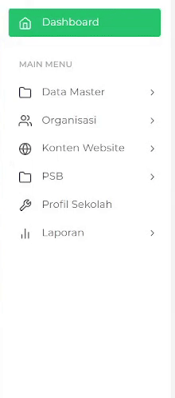

# Menu Sidebar

<figure><figcaption>
Sidebar PPDB Sintasi
</figcaption></figure>

Sidebar akan menampilkan fitur menu yang tersedia pada website PPDB Sintasi. Fitur menu yang tersedia antara lain:

* Data Master
  * Admin Sekolah: Menampilkan dan mengubah Admin yang terdaftar pada Sekolah yang terkait
* Organisasi
  * Cabang: Menampilkan dan mengubah cabang sekolah yang terkait
  * Unit: Menampilkan dan mengubah unit sekolah dari berbagai cabang sekolah yang terkait
* Konten Website:
  * Artikel Sekolah: Menampilkan dan mengubah artikel yang terdapat pada website sekolah
  * Konten Banner: Menampilkan dan mengubah banner yang tertampil pada halaman depan website sekolah
  * Konten Galeri: Menampilkan dan mengubah galeri yang tertampil pada halaman depan website sekolah
  * Testimoni Alumni: Menampilkan dan mengubah testimoni alumni yang tertampil pada halaman depan website sekolah
  * Fasilitas Sekolah: Menampilkan dan mengubah fasilitas yang tertampil pada halaman depan website sekolah
* PSB:
  * Gelombang:  Mendata pembukaan dan penutupan gelombang pendaftaran pada sekolah yang terkait
  * Registrasi Siswa: Menampilakan formulir pendaftaran Calon Siswa yang dapat diinput oleh admin sekolah
* Laporan
  * Pendaftaran: Memberikan informasi pendaftaran pada periode tertentu yang dapat diunduh dalam bentuk PDF dan Excel


Informasi yang ditampilkan dapat berubah seiring waktu dan akan diperbaharui secara berkala

